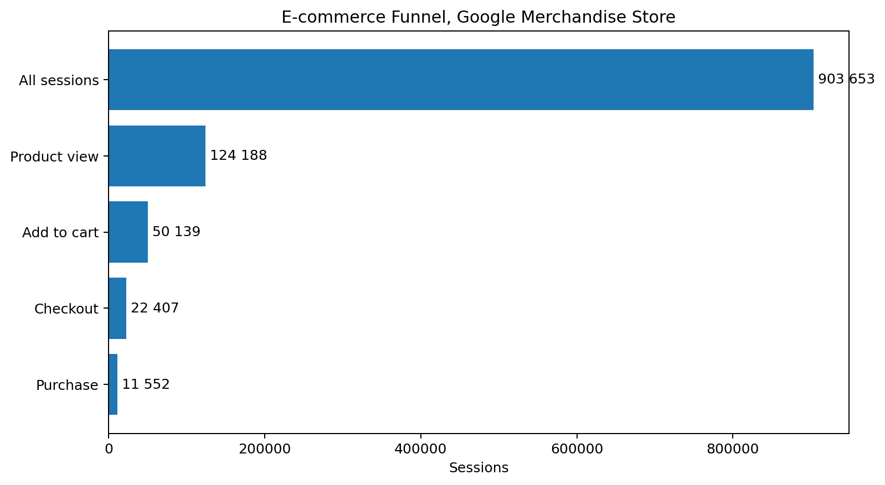
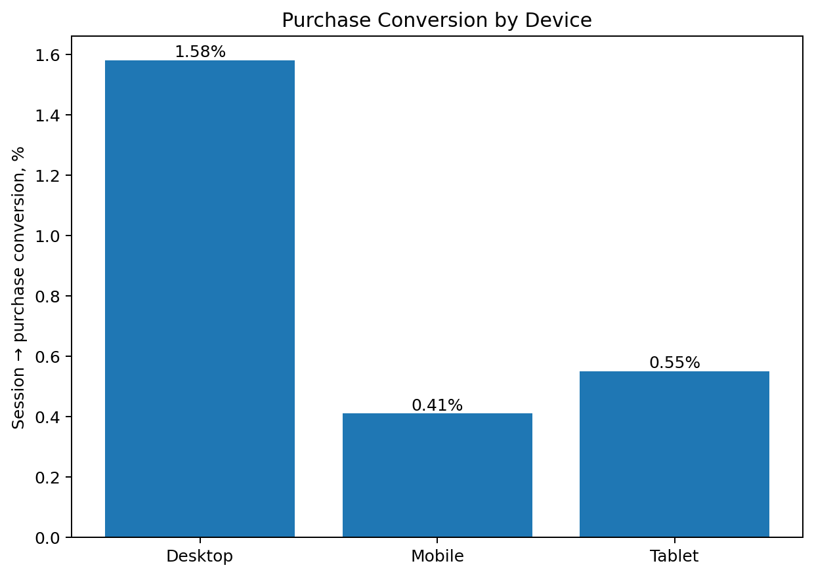
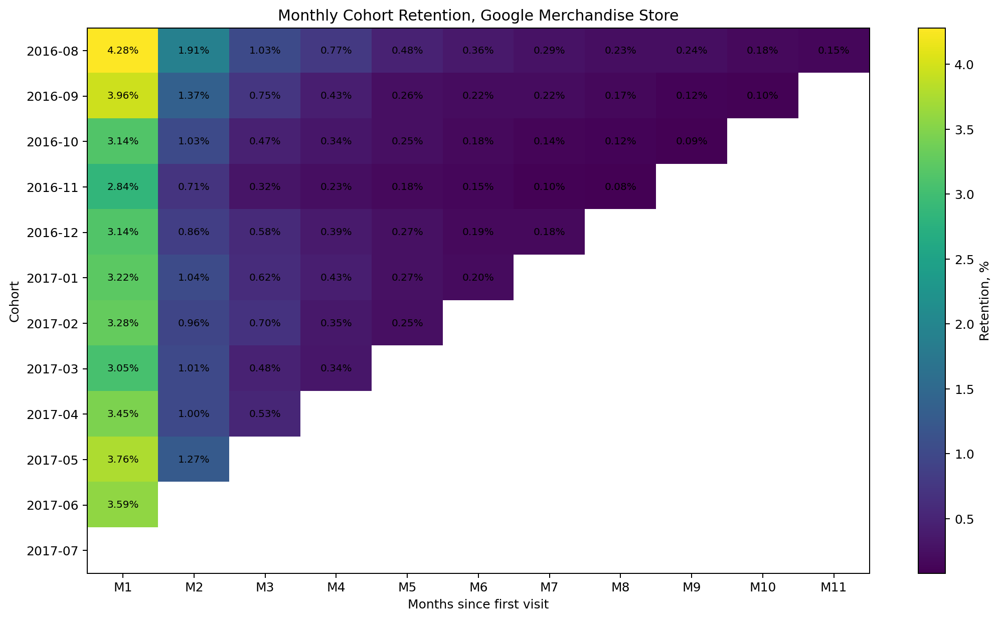
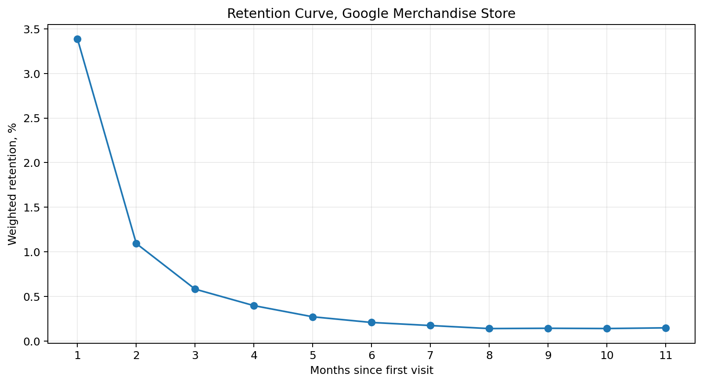

# Google Merchandise Store — Product Analytics

Pet project based on the public **Google Analytics Sample / Google Merchandise Store** dataset in BigQuery.

The goal is to analyze the e-commerce user journey, identify funnel bottlenecks, compare device segments, and evaluate user retention.

## Stack

- BigQuery SQL
- Python
- pandas
- matplotlib
- statsmodels

## Dataset

Source: `bigquery-public-data.google_analytics_sample.ga_sessions_*`

Period analyzed: **2016-08-01 — 2017-08-01**

- **903,653 sessions**
- **714,167 unique users**
- **11,552 sessions with purchase**
- **12,115 transactions**

## Analysis

### 1. E-commerce funnel

The funnel was built from session-level Google Analytics e-commerce events:

`All sessions → Product view → Add to cart → Checkout → Purchase`

| Stage | Sessions | Conversion from previous |
|---|---:|---:|
| All sessions | 903,653 | — |
| Product view | 124,188 | 13.74% |
| Add to cart | 50,139 | 40.37% |
| Checkout | 22,407 | 44.69% |
| Purchase | 11,552 | 51.56% |

The largest drop within the product funnel occurs between **Product view → Add to cart**: about **59.63%** of sessions do not progress to the next step.



### 2. Device segmentation

Session-to-purchase conversion differs substantially by device:

| Device | Sessions | Purchases | Session → Purchase |
|---|---:|---:|---:|
| Desktop | 664,479 | 10,528 | **1.58%** |
| Mobile | 208,725 | 856 | **0.41%** |
| Tablet | 30,449 | 168 | **0.55%** |

Desktop conversion is approximately **3.86× higher than mobile**.

The gap is visible throughout the lower funnel: mobile users have lower conversion from product view to cart, cart to checkout, and checkout to purchase. This makes the mobile purchase flow a useful area for further product investigation.



### 3. Cohort retention

Users were assigned to cohorts by the month of their first observed visit.

Weighted retention across cohorts:

- **M1: 3.39%**
- **M2: 1.09%**
- **M3: 0.58%**

M1 retention ranged from **2.84% to 4.28%** across cohorts, with a sharp decrease after the first month and a long low-retention tail.





### 4. Statistical comparison

Desktop and mobile session-to-purchase conversion were compared with a two-proportion z-test.

- Desktop CR: **1.584%**
- Mobile CR: **0.410%**
- Absolute difference: **1.174 percentage points**
- Desktop / mobile conversion ratio: **3.86×**
- z-statistic: **41.26**
- p-value: **< 0.001**
- 95% CI for the absolute difference: approximately **[1.134; 1.215] p.p.**

The difference is statistically significant.

However, this is **not a controlled A/B experiment**: users were not randomly assigned to device groups. Therefore, the result should be interpreted as an observed segment difference, not as a causal effect of device type.

## Key findings

1. Overall session-to-purchase conversion is about **1.28%**.
2. The largest loss inside the product funnel occurs at **Product view → Add to cart**.
3. Mobile users convert substantially worse than desktop users at every lower stage of the funnel.
4. Retention is low and drops sharply after the first month.
5. The mobile funnel and early retention are the main areas for further product investigation.

## Repository structure

```text
.
├── data/
│   ├── funnel.csv
│   ├── device_funnel.csv
│   └── retention.csv
├── images/
│   ├── funnel.png
│   ├── device_conversion.png
│   ├── cohort_retention_heatmap.png
│   └── retention_curve.png
├── notebooks/
│   └── analysis.ipynb
├── sql/
│   ├── 01_data_profiling.sql
│   ├── 02_funnel_by_device.sql
│   └── 03_monthly_retention.sql
├── requirements.txt
└── README.md
```

## How to run

```bash
pip install -r requirements.txt
jupyter notebook notebooks/analysis.ipynb
```

## Limitations

- The dataset is a public, anonymized sample.
- Device comparison is observational rather than randomized.
- Cohorts have different available follow-up windows.
- The dataset contains only one day of August 2017; that day was excluded from the retention analysis.

## Possible next steps

- Analyze acquisition channels (`source / medium`)
- Compare new vs returning users
- Investigate mobile funnel bottlenecks in more detail
- Design an A/B test for a mobile checkout hypothesis
- Add a dashboard
