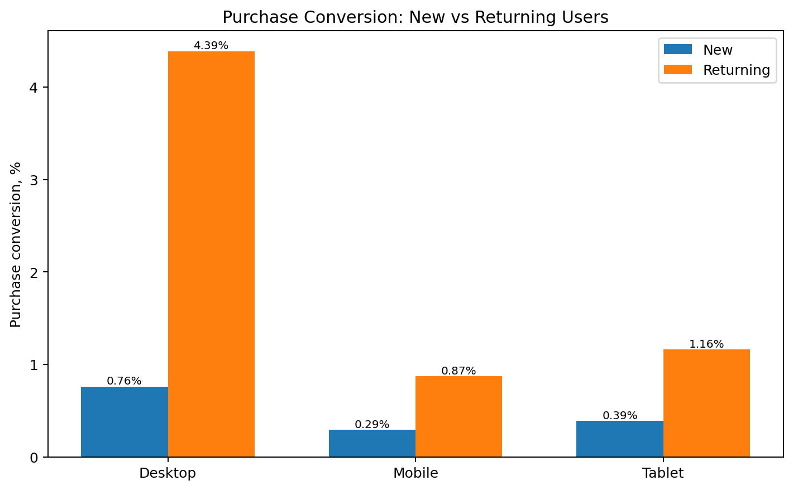
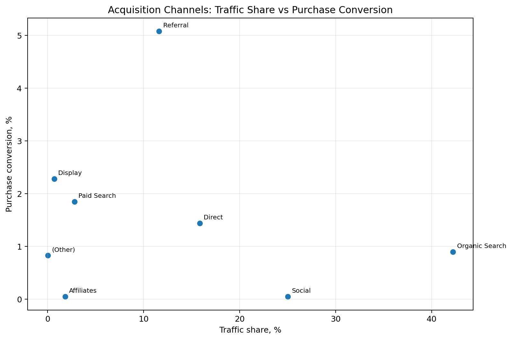

# Google Merchandise Store — Product Analytics

A portfolio project using **BigQuery SQL + Python** to analyze user behavior in the public Google Analytics Sample dataset for Google Merchandise Store.

The project focuses on a practical product-analytics workflow: **data quality → funnel → segmentation → retention → statistical testing → experiment design**.

## Executive summary

- **903,653 sessions** and **714,167 users** analyzed across Aug 2016–Aug 2017.
- Overall **session → purchase conversion: 1.28%**.
- Largest internal funnel loss: **Product view → Add to cart**, ~**59.6% drop-off**.
- Desktop purchase conversion: **1.58%** vs **0.41%** on mobile.
- The desktop–mobile gap persists among both **new and returning** users.
- **Referral** converts at **5.08%** and generates ~**46% of purchases** from only **11.6% of sessions**.
- Weighted retention: **M1 3.39% → M2 1.09% → M3 0.58%**.
- A two-proportion z-test finds a statistically significant desktop/mobile difference (`p < 0.001`), while the project explicitly avoids interpreting this observational result as causal.
- A feasible A/B test is proposed for the mobile Product view → Add to cart step.

## Stack

`BigQuery SQL` · `Python` · `pandas` · `NumPy` · `matplotlib` · `statsmodels`

## Business questions

1. Where are the biggest losses in the e-commerce funnel?
2. Does purchase conversion differ by device?
3. Is the device gap explained only by new/returning user mix?
4. Which acquisition channels combine traffic volume with strong conversion?
5. How quickly do users return after their first observed visit?
6. Which observed problem is suitable for a controlled product experiment?

## Dataset

BigQuery public dataset:

```text
bigquery-public-data.google_analytics_sample.ga_sessions_*
```

Observed period: **2016-08-01 — 2017-08-01**

| Metric | Value |
|---|---:|
| Sessions | 903,653 |
| Unique users | 714,167 |
| Sessions with purchase | 11,552 |
| Transactions | 12,115 |

Raw session-level data are queried directly in BigQuery and are **not stored in this repository**. Only small aggregated outputs needed to reproduce the Python analysis are committed.

## 1. Data quality

A dedicated SQL check validates session uniqueness.

- `(fullVisitorId, visitId)` repeats for **898** keys.
- Every repeated pair has a **different `visitStartTime` and date**.
- `(fullVisitorId, visitId, visitStartTime)` is unique for **all 903,653 rows**.
- Therefore the 898 repeated pairs are retained as distinct sessions rather than removed as duplicates.

SQL: [`sql/00_data_quality.sql`](sql/00_data_quality.sql)

## 2. E-commerce funnel

The session-level funnel uses direct ecommerce events from `hits.eCommerceAction.action_type`:

```text
All sessions → Product view → Add to cart → Checkout → Purchase
```

| Stage | Sessions | Conversion from previous |
|---|---:|---:|
| All sessions | 903,653 | — |
| Product view | 124,188 | 13.74% |
| Add to cart | 50,139 | 40.37% |
| Checkout | 22,407 | 44.69% |
| Purchase | 11,552 | 51.56% |

The largest internal drop-off is **Product view → Add to cart: ~59.6%**.


## 3. Device segmentation

| Device | Sessions | Purchases | Session → Purchase |
|---|---:|---:|---:|
| Desktop | 664,479 | 10,528 | **1.58%** |
| Mobile | 208,725 | 856 | **0.41%** |
| Tablet | 30,449 | 168 | **0.55%** |

Desktop conversion is about **3.86×** mobile conversion.


This gap appears at several lower-funnel steps, so the result is not driven only by the final purchase event.

## 4. New vs returning users

Returning users convert much better than new users on every device:

| User type | Desktop | Mobile | Tablet |
|---|---:|---:|---:|
| New | 0.76% | 0.29% | 0.39% |
| Returning | 4.39% | 0.87% | 1.16% |

The desktop–mobile gap persists **within both user types**, so aggregate device differences are not explained only by different new/returning composition.



## 5. Acquisition channels

| Channel | Traffic share | Purchase CR | Purchase share |
|---|---:|---:|---:|
| Organic Search | 42.22% | 0.90% | 29.80% |
| Social | 25.02% | 0.05% | 0.90% |
| Direct | 15.83% | 1.44% | 17.84% |
| Referral | 11.60% | **5.08%** | **46.07%** |
| Paid Search | 2.80% | 1.85% | 4.06% |
| Affiliates | 1.82% | 0.05% | 0.08% |
| Display | 0.69% | 2.28% | 1.24% |

Referral stands out: only **11.6% of sessions** but about **46% of purchases**.

Social is the opposite: **25.0% of sessions** with only **0.05% purchase conversion**.



**Caution:** conversion rate alone does not measure channel profitability. Acquisition cost, revenue and campaign intent are required for ROI conclusions.

## 6. Cohort retention

Cohorts are defined by the month of each user's **first observed visit** in the dataset.

Weighted retention:

- **M1: 3.39%**
- **M2: 1.09%**
- **M3: 0.58%**

M1 retention ranges from **2.84% to 4.28%** across cohorts.


## 7. Statistical comparison

A two-proportion z-test compares session → purchase conversion for desktop and mobile.

- Desktop CR: **1.584%**
- Mobile CR: **0.410%**
- Absolute difference: **1.174 p.p.**
- Conversion ratio: **3.86×**
- z-statistic: **41.26**
- p-value: **< 0.001**
- 95% CI for the absolute difference: approximately **[1.134; 1.215] p.p.**

This is **not an A/B test**. Users were not randomly assigned to device groups, so the result shows a robust association, not a causal effect.

## 8. Experiment design

The strongest actionable candidate is the mobile **Product view → Add to cart** step:

- mobile baseline: **32.46%**
- desktop comparison: **42.76%**

Proposed test: a mobile product-page treatment that makes Add to cart more prominent and reduces interaction friction.

MVP design:

- primary metric: Product view → Add to cart conversion
- MDE: **+5 p.p.** (32.46% → 37.46%)
- α = 0.05
- power = 80%
- 50/50 split
- nominal sample: **1,427 per group**
- with 10% buffer: **1,570 per group / 3,140 total**
- historical traffic implies roughly **45 days** at the sample's average eligible volume

Full design: [`docs/experiment_design.md`](docs/experiment_design.md)

## Key product hypotheses

1. **Mobile product-page friction:** a less prominent CTA, variant-selection friction, or layout differences may contribute to lower mobile Product view → Add to cart conversion.
2. **Returning-user intent:** returning users may have stronger purchase intent or greater familiarity/trust, contributing to much higher conversion.
3. **Channel quality differences:** Referral traffic may contain higher-intent users, while Social may include large volumes of low-intent or campaign-driven sessions.
4. **Weak repeat behavior:** low early retention suggests many visits are one-off; lifecycle messaging, remarketing or repeat-purchase mechanics would be areas for further investigation.

These are **hypotheses for validation**, not causal conclusions.

## Repository structure

```text
.
├── data/                       # small aggregated outputs only
├── docs/
│   └── experiment_design.md
├── images/
├── notebooks/
│   └── analysis.ipynb
├── sql/
│   ├── 00_data_quality.sql
│   ├── 01_data_profiling.sql
│   ├── 02_funnel_by_device.sql
│   ├── 03_monthly_retention.sql
│   ├── 04_new_vs_returning_by_device.sql
│   └── 05_channel_performance.sql
├── .gitignore
├── requirements.txt
└── README.md
```

## Reproduce the analysis

```bash
pip install -r requirements.txt
jupyter notebook notebooks/analysis.ipynb
```

The SQL files can be run in BigQuery against the public dataset. Their compact outputs are included in `data/` so the Python notebook can be viewed and executed without downloading the raw dataset.

## Limitations

- The dataset is public, historical and anonymized.
- Segment comparisons are observational and cannot establish causality.
- The earliest retention cohort can include users whose true first-ever visit occurred before the observation window (**left censoring**).
- Cohorts have unequal follow-up windows.
- Channel conversion is not equivalent to marketing ROI because cost/revenue context is incomplete.
- The A/B section is an experiment **design**, not a completed randomized test.

## Possible next steps

- Revenue / revenue-per-session analysis by acquisition channel
- Country or market segmentation
- More detailed mobile funnel diagnostics
- Current-traffic power analysis before running the proposed experiment
- Dashboard for ongoing monitoring
